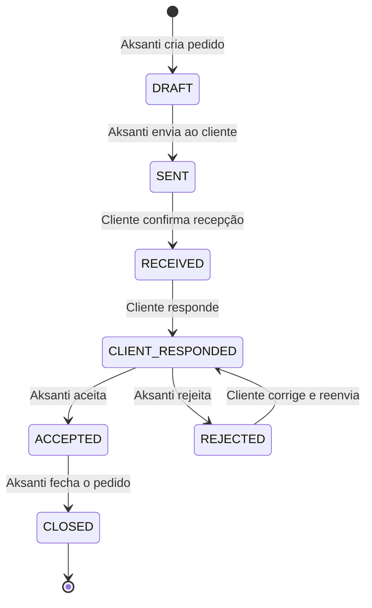

# 🏗️ ARMS — Plano de Implementação

> **Aksanti Request Management System — Fusão Híbrida Oficial**
> Schema: `arms` | PostgreSQL 14+ | **BD FINALIZADA — NÃO MEXER**

---

## 1. Stack Tecnológica

| Camada | Tecnologia | Porquê |
|--------|-----------|--------|
| **Backend** | Laravel 11 (PHP 8.2+) | XAMPP nativo, Eloquent, Sanctum |
| **Frontend** | React 18 + Inertia.js | SPA feel, sem API REST separada |
| **Build** | Vite 5 | Integrado no Laravel |
| **BD** | PostgreSQL 14+ | Schema `arms` já criado com triggers, RLS, e funções |
| **Criptografia** | libsodium (PHP) + tweetnacl (JS) | Campos `encrypted_*` |
| **Storage** | Laravel Filesystem (local → S3) | Attachments (`storage_key`) |
| **Email** | Laravel Mail | Notificações `channel = 'EMAIL'` |
| **Real-time** | Laravel Reverb | Notificações `channel = 'IN_APP'` |

---

## 2. Mapeamento Directo: Schema → Laravel

> [!CAUTION]
> Nenhuma migration Laravel. Todos os Models usam `protected $table` apontando para tabelas existentes no schema `arms`.

### Tabelas do Schema vs Models

| Tabela `arms.` | Model Laravel | Relações Chave |
|---|---|---|
| `auth_user` | `AuthUser` | hasOne Profile, hasMany Devices, belongsToMany Areas |
| `user_profile` | `UserProfile` | belongsTo AuthUser |
| `user_devices` | `UserDevice` | belongsTo AuthUser |
| `area` | `Area` | belongsToMany AuthUser (via area_membership), hasMany Requests |
| `area_membership` | — (pivot) | Pivot com campo `role` (MEMBER/MANAGER) |
| `client` | `Client` | hasMany Contacts, hasMany Requests |
| `client_contact` | `ClientContact` | belongsTo Client, belongsTo AuthUser (nullable) |
| `request_sequence` | — | Só usado pela função PG `next_request_reference()` |
| `request` | `ServiceRequest` | belongsTo Area/Client/AuthUser, hasMany Responses/Comments/Attachments |
| `request_response` | `RequestResponse` | belongsTo ServiceRequest/AuthUser |
| `request_comment` | `RequestComment` | belongsTo ServiceRequest/AuthUser |
| `attachment` | `Attachment` | belongsTo ServiceRequest OR RequestResponse |
| `request_audit_log` | `RequestAuditLog` | belongsTo ServiceRequest (READ-ONLY — trigger gera) |
| `audit_logs` | `AuditLog` | Genérico (JSONB old_data/new_data) |
| `notification` | `Notification` | belongsTo AuthUser, belongsTo ServiceRequest |

### Campos com Lógica Especial

| Campo | Lógica |
|---|---|
| `auth_user.user_type` | CHECK: `'AKSANTI'` ou `'CLIENT'` — define toda a autorização |
| `auth_user.password_hash` | bcrypt via Laravel Hash facade |
| `request.reference` | Auto-gerado pela função PG `next_request_reference()` → `AKS-2026-00042` |
| `request.encrypted_description` | Encriptado no browser, guardado como TEXT |
| `request.status` | CHECK: DRAFT→SENT→RECEIVED→CLIENT_RESPONDED→ACCEPTED/REJECTED→CLOSED |
| `request_response.encrypted_body` | Encriptado |
| `request_comment.encrypted_body` | Encriptado |
| `request_comment.visibility` | `'BOTH'` (todos vêem) ou `'AKSANTI_ONLY'` (interno) |
| `attachment.storage_key` | Path no S3/MinIO/local |
| `notification.channel` | `'IN_APP'` ou `'EMAIL'` |

### Estado Machine (Gerido por Trigger PG `trg_request_valid_transition`)



> [!IMPORTANT]
> A validação de transições vive no PostgreSQL (trigger). O Laravel só faz `UPDATE status = 'X'` e o PG rejeita se for inválido.

---

## 3. Estrutura do Projecto

```
ARMS — Aksanti Request Management System/
├── app/
│   ├── Http/
│   │   ├── Controllers/
│   │   │   ├── Auth/
│   │   │   │   ├── LoginController.php
│   │   │   │   └── ProfileController.php
│   │   │   ├── DashboardController.php
│   │   │   ├── AreaController.php
│   │   │   ├── ClientController.php
│   │   │   ├── ClientContactController.php
│   │   │   ├── ServiceRequestController.php
│   │   │   ├── RequestResponseController.php
│   │   │   ├── RequestCommentController.php
│   │   │   ├── AttachmentController.php
│   │   │   ├── NotificationController.php
│   │   │   └── Admin/
│   │   │       ├── UserController.php
│   │   │       └── AreaController.php
│   │   ├── Middleware/
│   │   │   ├── SetArmsSchema.php          # SET search_path TO arms, public
│   │   │   ├── EnsureAksantiUser.php      # user_type = 'AKSANTI'
│   │   │   └── EnsureAdmin.php            # is_admin = TRUE
│   │   └── Requests/                      # Form validation
│   │       ├── StoreRequestRequest.php
│   │       ├── StoreResponseRequest.php
│   │       └── StoreCommentRequest.php
│   │
│   ├── Models/
│   │   ├── AuthUser.php
│   │   ├── UserProfile.php
│   │   ├── UserDevice.php
│   │   ├── Area.php
│   │   ├── Client.php
│   │   ├── ClientContact.php
│   │   ├── ServiceRequest.php
│   │   ├── RequestResponse.php
│   │   ├── RequestComment.php
│   │   ├── Attachment.php
│   │   ├── RequestAuditLog.php
│   │   ├── AuditLog.php
│   │   └── Notification.php
│   │
│   ├── Services/
│   │   ├── CryptoService.php              # E2EE: encrypt/decrypt campos encrypted_*
│   │   └── NotificationService.php        # Despacha IN_APP + EMAIL
│   │
│   ├── Policies/
│   │   ├── ServiceRequestPolicy.php       # Quem vê/edita pedidos
│   │   ├── ClientPolicy.php
│   │   └── AreaPolicy.php
│   │
│   └── Events/
│       ├── RequestStatusChanged.php
│       └── NewResponseReceived.php
│
├── resources/js/
│   ├── app.jsx
│   ├── Layouts/
│   │   ├── AuthenticatedLayout.jsx
│   │   ├── GuestLayout.jsx
│   │   └── Sidebar.jsx
│   ├── Pages/
│   │   ├── Auth/Login.jsx
│   │   ├── Dashboard/
│   │   │   ├── AksantiDashboard.jsx
│   │   │   └── ClientDashboard.jsx
│   │   ├── Requests/
│   │   │   ├── Index.jsx
│   │   │   ├── Create.jsx
│   │   │   └── Show.jsx
│   │   ├── Clients/
│   │   │   ├── Index.jsx
│   │   │   └── Show.jsx
│   │   ├── Notifications/Index.jsx
│   │   └── Admin/
│   │       ├── Users.jsx
│   │       └── Areas.jsx
│   ├── Components/
│   │   ├── ui/ (Button, Modal, Badge, Card, DataTable, Input, FileUpload)
│   │   ├── StatusBadge.jsx
│   │   ├── StatusTimeline.jsx
│   │   └── CommentThread.jsx
│   └── lib/
│       ├── crypto.js                      # tweetnacl E2EE browser-side
│       └── utils.js
│
├── resources/css/app.css                  # Design system
├── routes/web.php
├── routes/auth.php
├── database/schema/arms_hybrid_fusion.sql # Cópia de referência (READ-ONLY)
├── .env
├── vite.config.js
└── package.json
```

---

## 4. Fases de Desenvolvimento

### FASE 1 — Fundação `[Começamos aqui]`
> Laravel + React + Auth + Layout Premium

| # | Tarefa |
|---|--------|
| 1.1 | Criar projecto Laravel 11 no workspace |
| 1.2 | Instalar Inertia.js + React + Vite |
| 1.3 | `.env` → PostgreSQL (`arms` schema) |
| 1.4 | Middleware `SetArmsSchema` |
| 1.5 | Model `AuthUser` + `UserProfile` |
| 1.6 | Login/Logout (Sanctum + sessão) |
| 1.7 | Layout: Sidebar premium (Royal Navy & Gold) |
| 1.8 | Dashboard vazio (rota protegida) |

✅ **Resultado:** Login → Dashboard com sidebar navegável.

---

### FASE 2 — CRUD Core
> Áreas, Clientes, Pedidos

| # | Tarefa |
|---|--------|
| 2.1 | Models: Area, Client, ClientContact, ServiceRequest |
| 2.2 | List + Create + Detail de Áreas |
| 2.3 | List + Create + Detail de Clientes e Contactos |
| 2.4 | List + Create + Detail de Pedidos (sem E2EE por agora) |
| 2.5 | `reference` auto-gerado pelo PG ao INSERT |
| 2.6 | Upload de Attachments (Laravel Storage) |
| 2.7 | DataTable com filtros (status, área, cliente) |

✅ **Resultado:** CRUD completo, `AKS-2026-XXXXX` gerado automaticamente.

---

### FASE 3 — Fluxo & Interação
> State machine, respostas, comentários, timeline

| # | Tarefa |
|---|--------|
| 3.1 | Botões de transição de status (PG valida) |
| 3.2 | RequestResponse: cliente responde |
| 3.3 | Aceitar/Rejeitar resposta (decided_by, decided_at) |
| 3.4 | Comentários (visibility: BOTH / AKSANTI_ONLY) |
| 3.5 | Timeline visual (lê `request_audit_log`) |
| 3.6 | Vista do Cliente (só vê o que lhe pertence) |

✅ **Resultado:** Fluxo DRAFT→CLOSED funcional com audit trail.

---

### FASE 4 — Segurança E2EE
> Criptografia ponta-a-ponta nos campos sensíveis

| # | Tarefa |
|---|--------|
| 4.1 | CryptoService (PHP): libsodium encrypt/decrypt |
| 4.2 | crypto.js (Browser): tweetnacl keypairs |
| 4.3 | Registo de devices (`user_devices`) |
| 4.4 | Encriptar: `encrypted_description`, `encrypted_body` |
| 4.5 | Authorization Policies (por user_type + area_membership) |
| 4.6 | Middleware: `EnsureAksantiUser`, `EnsureAdmin` |

✅ **Resultado:** Dados sensíveis blindados, acesso por role.

---

### FASE 5 — Notificações & Dashboards
> Real-time + métricas

| # | Tarefa |
|---|--------|
| 5.1 | NotificationService: insere na tabela `notification` |
| 5.2 | Bell icon + dropdown (IN_APP) |
| 5.3 | Email dispatch (channel = EMAIL) |
| 5.4 | Dashboard Aksanti: KPIs, SLA, gráficos por status/área |
| 5.5 | Dashboard Cliente: seus pedidos e pendências |
| 5.6 | WebSocket com Laravel Reverb (live updates) |

✅ **Resultado:** Dashboards ricos + notificações em tempo real.

---

### FASE 6 — Polish & Deploy
> UX final, testes, produção

| # | Tarefa |
|---|--------|
| 6.1 | Responsividade mobile |
| 6.2 | Dark mode |
| 6.3 | Loading/empty/error states |
| 6.4 | Testes PHPUnit (fluxos críticos) |
| 6.5 | Build de produção + deploy |

✅ **Resultado:** Sistema pronto para produção.

---

## 5. Design System

| Token | Valor | Uso |
|-------|-------|-----|
| `--navy` | `#0A1628` | Sidebar, backgrounds escuros |
| `--gold` | `#C8A951` | Accent, botões, badges activos |
| `--surface` | `#FFFFFF` | Cards, modais |
| `--bg` | `#F8FAFC` | Background geral |
| `--success` | `#10B981` | ACCEPTED, CLOSED |
| `--warning` | `#F59E0B` | DRAFT, SENT, PENDING |
| `--danger` | `#EF4444` | REJECTED |
| `--info` | `#3B82F6` | RECEIVED, CLIENT_RESPONDED |
| Font body | `Inter` | — |
| Font display | `Outfit` | Títulos |
| Radius | `12px` | — |

---

## 6. Regra Absoluta

> [!CAUTION]
> **A BASE DE DADOS ESTÁ FINALIZADA.**
> - Zero `php artisan migrate`
> - Os triggers (`trg_request_valid_transition`, `trg_request_status_audit`, `trg_audit_log_immutable`) já existem no PG
> - A função `next_request_reference()` gera o `reference` automaticamente
> - O RLS já está activado na tabela `request`
> - O seed data das áreas já foi inserido
> - O Laravel apenas lê e escreve — toda a lógica de negócio crítica vive no PostgreSQL

---

**Diz "GO" para arrancar com a FASE 1.** 🚀
