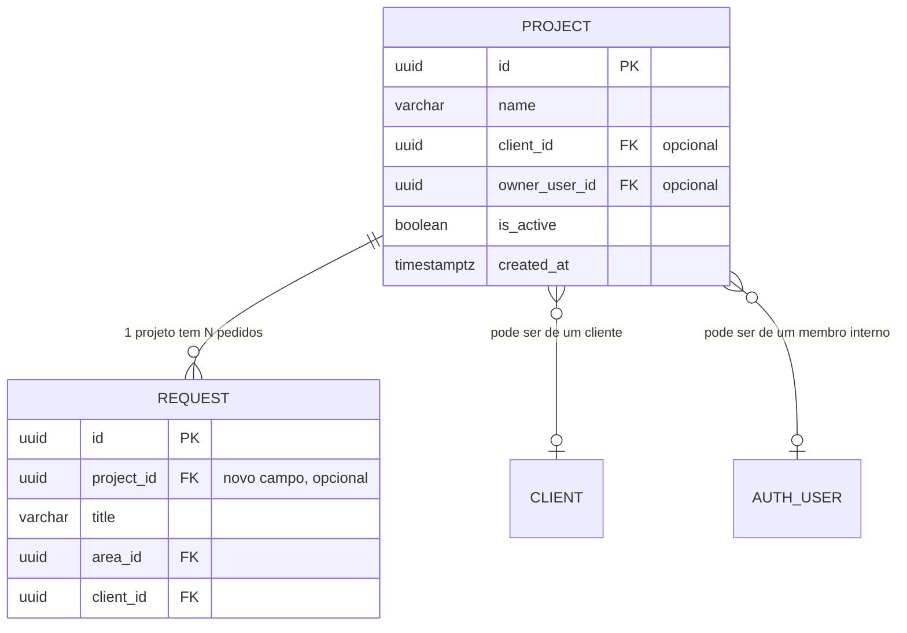

# Módulo Projetos — ARMS

Implementação de um novo módulo de gestão de Projetos no ARMS, seguindo os padrões existentes dos módulos de Clientes e Departamentos.

## Compreensão do Requisito

O módulo Projetos introduz uma nova entidade que agrupa pedidos (requests). A relação é **N pedidos → 1 Projeto**.

### Funcionalidades Pretendidas:
1. **Novo botão "Projectos"** no menu lateral (sidebar) — apenas para admins
2. **Página de Gestão de Projectos** (`projectos.html`) — com listar, cadastrar, editar, eliminar, exportar relatórios. Acesso restrito a admins.
3. **Associar projeto ao pedido (Formulário)** — novo combo condicional consoante o perfil
4. **Filtrar pedidos por projeto** — novo filtro na página de gestão de pedidos (`pedidos.html`)
5. **Edição de Pedidos:** A partir de agora, a edição de um pedido (request) será permitida em **qualquer estado** (removendo o bloqueio atual).

### Regra de Negócio do Combo e Filtro de Projetos:

| Perfil | Comportamento do Combo e Filtro |
|--------|---------------------------------|
| **Admin** | Vê **todos** os projetos ativos. Combo/Filtro sempre visível. |
| **Cliente** | Só aparece se o admin associou projetos ao seu `client_id`. Oculto caso contrário. |
| **Colaborador Interno** | Só aparece se o admin associou projetos ao seu `user_id`. Oculto caso contrário. |

---

## User Review Required

> [!WARNING]
> **Edição de Pedidos em Qualquer Estado:** 
> O ficheiro `editar-pedido.php` bloqueia atualmente a edição caso o pedido esteja num estado que não seja `DRAFT` ou `CLIENT_RESPONDED`. Além disso, bloqueia se for `CLOSED`.
> Com a tua instrução de editar "em qualquer estado", **vou remover estas validações do PHP e atualizar o botão de edição no Frontend (se estiver a ser ocultado por estado) para que esteja sempre visível e funcional**. Se quiseres manter o bloqueio apenas para `CLOSED`, avisa-me (por agora assumo que até os fechados se podem editar).

---

## Proposta de Arquitectura

### Relação de Dados (Modelo ER)

---

## Proposed Changes

### Componente 1: Base de Dados (Migration)

#### [NEW] [migration_add_project.sql](file:///c:/xampp/htdocs/ARMS%20%E2%80%94%20Aksanti%20Request%20Management%20System/Backend/bd/migration_add_project.sql)

- Cria tabela `arms.project` com PK, campos de associação e constraint CHECK
- Índices correspondentes
- Adiciona coluna `project_id` à tabela `arms.request` (opcional/nullable)

---

### Componente 2: Backend API — Projetos

#### [NEW] [projectos.php](file:///c:/xampp/htdocs/ARMS%20%E2%80%94%20Aksanti%20Request%20Management%20System/Backend/api/projectos.php)
Endpoint GET para listar projetos. 

#### [NEW] [criar-projecto.php](file:///c:/xampp/htdocs/ARMS%20%E2%80%94%20Aksanti%20Request%20Management%20System/Backend/api/criar-projecto.php)
Endpoint POST para criar projeto. 

#### [NEW] [editar-projecto.php](file:///c:/xampp/htdocs/ARMS%20%E2%80%94%20Aksanti%20Request%20Management%20System/Backend/api/editar-projecto.php)
Endpoint POST para editar projeto.

#### [NEW] [eliminar-projecto.php](file:///c:/xampp/htdocs/ARMS%20%E2%80%94%20Aksanti%20Request%20Management%20System/Backend/api/eliminar-projecto.php)
Endpoint POST para eliminar (ou desativar) um projeto. Retorna erro se tiver pedidos associados (ou simplesmente faz um soft delete colocando `is_active = FALSE`).

---

### Componente 3: Backend API — Pedidos

#### [MODIFY] [formulario-dados.php](file:///c:/xampp/htdocs/ARMS%20%E2%80%94%20Aksanti%20Request%20Management%20System/Backend/api/formulario-dados.php)
Adicionar lógica para devolver a lista de projetos na resposta JSON (`data.projectos`).
A query varia conforme o perfil (Admin vê todos; Cliente/Colaborador vê apenas os que lhes estão associados).

#### [MODIFY] [criar-pedido.php](file:///c:/xampp/htdocs/ARMS%20%E2%80%94%20Aksanti%20Request%20Management%20System/Backend/api/criar-pedido.php)
Aceitar `project_id` (opcional) no INSERT.

#### [MODIFY] [editar-pedido.php](file:///c:/xampp/htdocs/ARMS%20%E2%80%94%20Aksanti%20Request%20Management%20System/Backend/api/editar-pedido.php)
- Remover as validações que bloqueiam a edição baseada no estado (`$statusEditaveis`).
- Adicionar o campo `project_id` na query de `UPDATE` (permitindo alterar o projeto de um pedido existente).

#### [MODIFY] [pedidos.php](file:///c:/xampp/htdocs/ARMS%20%E2%80%94%20Aksanti%20Request%20Management%20System/Backend/api/pedidos.php)
- Adicionar `r.project_id` e `p.name as project_name` no `SELECT` e `LEFT JOIN` na `arms.project` para o frontend exibir e filtrar.

---

### Componente 4: Frontend — Página de Projetos

#### [NEW] [projectos.html](file:///c:/xampp/htdocs/ARMS%20%E2%80%94%20Aksanti%20Request%20Management%20System/Frontend/projectos.html) e [projectos.js](file:///c:/xampp/htdocs/ARMS%20%E2%80%94%20Aksanti%20Request%20Management%20System/Frontend/js/pages/projectos.js)
Nova página de gestão (CRUD), seguindo o estilo de `clientes.html`. Terá botões para editar e eliminar. Restrito a administradores.

---

### Componente 5: Frontend — Formulário, Filtros e Detalhes do Pedido

#### [MODIFY] Sidebar em TODAS as páginas HTML (~12 ficheiros)
Adicionar link de menu para "Projectos" (visível só para admins com `menu-admin-only`).

#### [MODIFY] [novo-pedido-global.js](file:///c:/xampp/htdocs/ARMS%20%E2%80%94%20Aksanti%20Request%20Management%20System/Frontend/js/novo-pedido-global.js)
Adicionar campo condicional "Projeto" ao formulário de criação de pedido.

#### [MODIFY] [pedidos.html](file:///c:/xampp/htdocs/ARMS%20%E2%80%94%20Aksanti%20Request%20Management%20System/Frontend/pedidos.html)
Adicionar um novo select para filtro de projetos ao lado dos outros filtros (visível se existirem projetos associados).

#### [MODIFY] [pedidos.js](file:///c:/xampp/htdocs/ARMS%20%E2%80%94%20Aksanti%20Request%20Management%20System/Frontend/js/pedidos.js)
Atualizar localmente a tabela com o filtro de `project_id`.

#### [MODIFY] Página Detalhes do Pedido (`pedido-detalhe.html` e `pedido-detalhe.js`)
- Adicionar o campo "Projeto" na secção de edição.
- Garantir que o botão/ícone de "Editar Pedido" está sempre visível independentemente do estado.

---

### Componente 6: Internacionalização (i18n)
Adicionar traduções para o novo módulo (`nav.projectos`, etc.)

---

## Verification Plan

### Ordem de Implementação (Segura)
1. Migration SQL (criar tabela + ALTER TABLE) — Executar na BD
2. Modificações em APIs existentes (`formulario-dados.php`, `criar-pedido.php`, `editar-pedido.php`, `pedidos.php`)
3. Adicionar Filtro de Projeto em `pedidos.html` e `pedidos.js`
4. Adicionar Combo de Projeto no `novo-pedido-global.js` e em `pedido-detalhe.js`
5. Novos ficheiros backend (`projectos.php`, `criar-projecto.php`, `editar-projecto.php`, `eliminar-projecto.php`)
6. Novos ficheiros frontend (`projectos.html`, `projectos.js`) e modificação do menu em todas as páginas HTML
7. Testes e Validação Completa

> [!CAUTION]
> **A migration SQL deve ser executada no banco de dados de produção ANTES do deploy do código.**
